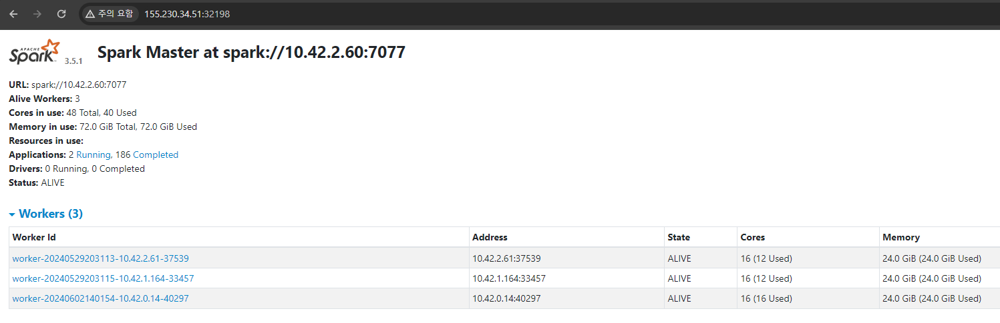

# Spark Donwload & Config

1. **Spark 다운로드 및 환경변수 설정**:
    ```sh
    # Spark 아카이브 파일 다운로드
    wget https://dlcdn.apache.org/spark/spark-3.5.1/spark-3.5.1-bin-hadoop3.tgz

    # 아카이브 파일 압축 해제 및 삭제
    tar -xzf spark-3.5.1-bin-hadoop3.tgz
    rm spark-3.5.1-bin-hadoop3.tgz

    # 디렉토리 이동
    sudo mv spark-3.5.1-bin-hadoop3 /opt/spark

    # RAPIDS Accelerator For Apache Spark Distribution 다운로드.
    # 공식 maven 참고
    # https://mvnrepository.com/artifact/com.nvidia/rapids-4-spark
    wget https://repo1.maven.org/maven2/com/nvidia/rapids-4-spark_2.12/24.06.1/rapids-4-spark_2.12-24.06.1.jar

    # .jar를 Spark jars로 이동. 
    sudo mv rapids-4-spark_2.12-24.06.1.jar /opt/spark/jars 

    # SPARK_HOME 환경변수 설정
    echo 'export SPARK_HOME=/opt/spark' >> ~/.bashrc
    echo 'export PATH=$PATH:$SPARK_HOME/bin:$SPARK_HOME/sbin' >> ~/.bashrc

    source ~/.bashrc

    # 설정 확인
    echo $SPARK_HOME
    ```

2. **Spark Conf 추가 및 설정 1**
    ```sh
    # spark-env.sh 생성.
    cp $SPARK_HOME/conf/spark-env.sh.template $SPARK_HOME/conf/spark-env.sh

    # 각 워커 노드의 코어, 메모리 할당량, GPU 사용량 및 GPU 조회 파일 경로 설정.
    echo 'export SPARK_WORKER_CORES=16' >> $SPARK_HOME/conf/spark-env.sh
    echo 'export SPARK_WORKER_MEMORY=24g' >> $SPARK_HOME/conf/spark-env.sh
    echo 'export SPARK_WORKER_OPTS="-Dspark.worker.resource.gpu.amount=4 -Dspark.worker.resource.gpu.discoveryScript=/opt/spark/conf/getGpusResources.sh' >> $SPARK_HOME/conf/spark-env.sh
    ```
    GPU 조회 파일은 [공식Github](https://github.com/apache/spark/blob/master/examples/src/main/scripts/getGpusResources.sh)를 참고하여 `/opt/spark/conf/` 에 `getGpusResources.sh`를 생성
    
3. **Spark Conf 추가 및 설정 2**
    ```sh
    # spark-defaults.conf 생성.
    cp $SPARK_HOME/conf/spark-defaults.conf.template $SPARK_HOME/conf/spark-defaults.conf

    # 라이브러리 경로 설정
    echo 'spark.driver.extraClassPath       $SPARK_HOME/jars/*.jar' >> $SPARK_HOME/conf/spark-defaults.conf
    echo 'spark.executor.extraClassPath     $SPARK_HOME/jars/*.jar' >> $SPARK_HOME/conf/spark-defaults.conf
    ```


# Deploy

1. Download resources for deploy
    ```
    git clone http://,,,,
    
    
    cd spark-standalone-kube
    ```

    배포에 사용할 리소스 
    ```
    docker/
    ├── dockerfile          -> To build Spark Master, Worker node Image
    └── jupyterDockerfile   -> To build Spark Driver (for Develop) node Image
    kube/
    ├── jupyter.yaml        -> To deploy Spark Driver (for Develop) node
    ├── master-deploy.yaml  -> To deploy Spark Master node
    ├── master-service.yaml -> To expose network Spark Master node
    ├── worker-deploy.yaml  -> To deploy Spark Worker node
    └── worker-service.yaml -> To expose network Spark Worker node
    ``` 

## Deploy Spark Cluster

1. Build & Push Spark Cluster Container Image
    ```sh
    cd docker

    cp -r $SPARK_HOME ./spark-home

    docker build -t <your_dockerhubID>/spark-standalone-3.5.1:v0.0.n .

    rm -rf spark-home/

    docker push <your_dockerhubID>/spark-standalone-3.5.1:v0.0.n

    cd ..
    ```
3. Deploy Spark Cluster to k8s

    1. 디렉토리 이동
        ```sh
        cd kube
        ```
    
    2. `master-deploy.yaml` 파일에서 `image` 필드를 사용자 정의 이미지로 변경.
        ```yaml
        apiVersion: apps/v1
        kind: Deployment
        metadata:
        name: spark-master
        namespace: spark
        spec:
        replicas: 1
        selector:
            matchLabels:
            app: spark-master
        template:
            metadata:
            labels:
                app: spark-master
            spec:
            containers:
            - name: spark-master
                image: <your_dockerhubID>/spark-standalone-3.5.1:v0.0.n # <-- Change
        ```
    3. Create Spark Master 
        ```sh
        kubectl create -f master-deploy.yaml master-service.yaml
        ```
        Status Check
        ```sh
        kubectl get all -n spark
        ```
        
        ```
        ...
        NAME                                READY   STATUS   ...
        pod/spark-master-57848975c6-fn5wk   1/1     Running  ...
        ...
        NAME                              TYPE      ...  PORT(S) 
        service/spark-master-ui-service   NodePort  ...  8080:32198/TCP
        service/spark-master-service      NodePort  ...  7077:32177/TCP
        ```

    4. Spark Master Pod IP 확인.</br>
        >_Ex. spark-master-57848975c6-fn5wk == <spark-master's Pod name>_
        ```
        kubectl get pod <spark-master's Pod name> -o jsonpath='{.status.podIP}'
        ```
    5. `worker-deploy.yaml` 파일에서 `image` 필드를 사용자 정의 이미지로 변경.</br>
        & `SPARK_MASTER_URL`을 위의 명령어를 이용하여 수정.
        ```yaml
        apiVersion: apps/v1
        kind: Deployment
        metadata:
          name: spark-worker
          namespace: spark
        spec:
          replicas: 3 # <-- Change If you want
          selector:
            matchLabels:
              app: spark-worker
          template:
            metadata:
              labels:
                app: spark-worker
            spec:
              containers:
              - name: spark-worker
                image: <your_dockerhubID>/spark-standalone-3.5.1:v0.0.n # <-- Change
                command: ["/bin/bash"]
                args: [...]
                env:
                - name: SPARK_MASTER_URL
                  value: "spark://<Spark Master Pod IP>:7077" # <-- Change
    6. Create Spark Workers 
        ```sh
        kubectl create -f worker-deploy.yaml worker-service.yaml
        ```
        Status Check
        ```sh
        kubectl get all -n spark
        ```
        
        ```
        ...
        NAME                                READY   STATUS   ...
        pod/spark-master-57848975c6-fn5wk   1/1     Running  ...
        pod/spark-worker-899656455-zxjb9    1/1     Running  ...
        pod/spark-worker-899656455-6svp9    1/1     Running  ...
        pod/spark-worker-899656455-zdqw7    1/1     Running  ...
        ...
        NAME                              TYPE      ...  PORT(S) 
        service/spark-worker-ui-service   NodePort  ...  8081:32187/TCP
        service/spark-master-ui-service   NodePort  ...  8080:32198/TCP
        service/spark-master-service      NodePort  ...  7077:32177/TCP
        ```

        Check Spark Master UI
        <p align="center">
        
        </p>

